# Gym Novel Gridworlds

Gym Novel Gridworlds are [OpenAI Gym](https://github.com/openai/gym) environments for developing and evaluating AI agents that can detect and adapt to unknown sudden novelties in their environments.
In each environment, the agent needs to craft objects using multiple recipes, which requires performing certain steps in some sequence.

## Installation
```
git clone https://github.com/gtatiya/gym-novel-gridworlds.git
cd gym-novel-gridworlds
pip install -e .
```

If you prefer, you can install directly from [PyPI](https://pypi.org/project/gym-novel-gridworlds/):
```
pip install gym-novel-gridworlds
```

## BibTeX
```
@misc{gym_novel_gridworlds,
  author = {Tatiya, Gyan},
  title = {Novel Gridworlds Environment for OpenAI Gym},
  year = {2020},
  publisher = {GitHub},
  journal = {GitHub repository},
  howpublished = {\url{https://github.com/gtatiya/gym-novel-gridworlds}},
}
```

## Development Environment

`Python 3.7.9` and following packages were used for development:<br><br>

### Python Packages
```
pip install gym==0.18.0
pip install keyboard==0.13.5
pip install matplotlib==3.3.3
pip install numpy==1.19.4
pip install stable-baselines==2.10.1
pip install tensorflow-gpu==1.15.0
```

## Running
```python
import gym
import gym_novel_gridworlds

env = gym.make('NovelGridworld-Pogostick-v1')

done = False
while not done:
        env.render()
        action = env.action_space.sample()
        obs, reward, done, info = env.step(action)

env.close()
```

### Play it yourself
Play the game using keyboard interface.
To change the environment and to inject a novelty you must edit keyboard_interface.py.
```
python tests/keyboard_interface.py
```

## Environments

In each environment, the agent needs to craft objects using multiple recipes, which requires performing certain steps in some sequence.
The default observation space is of type `gym.spaces.Dict` that contains information about the map, agent_location, agent_facing_id, and inventory_items_quantity.
Feel free to use [Observation Wrappers](https://github.com/gtatiya/gym-novel-gridworlds#observation-wrappers) to change observation space and [Wrappers](https://github.com/gtatiya/gym-novel-gridworlds#wrappers) to limit action space and more.

<table>

<tr>
<td>
<b>NovelGridworld-Bow-v0</b>
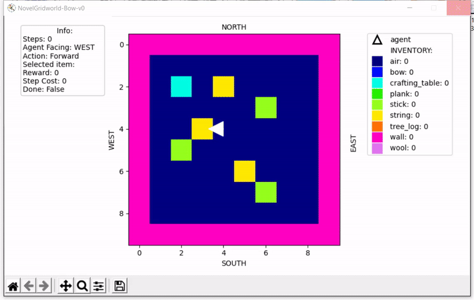
</td>
<td>
<b>NovelGridworld-Bow-v1</b>
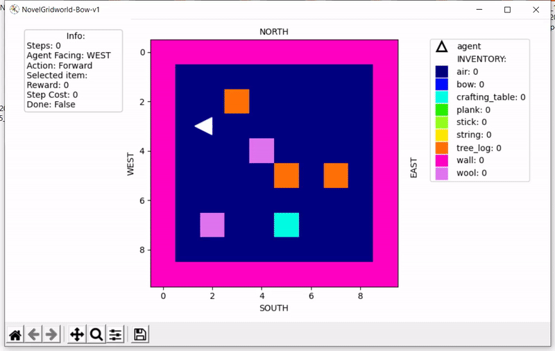
</td>
</tr>

<tr>
<td>
<b>NovelGridworld-Pogostick-v0</b>
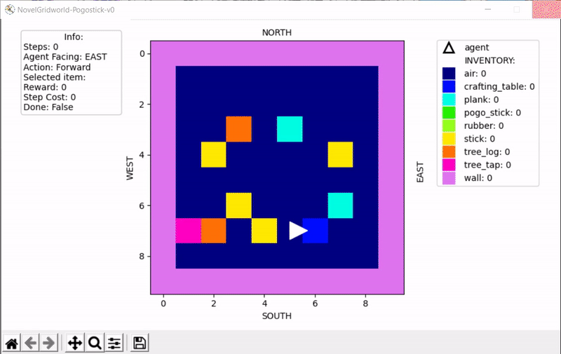
</td>
<td>
<b>NovelGridworld-Pogostick-v1</b>
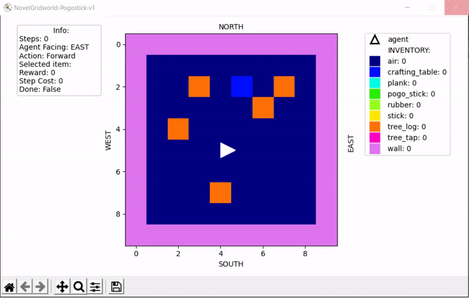
</td>
</tr>

</table>

### [Deprecated Environments](https://github.com/gtatiya/gym-novel-gridworlds/wiki#environments)

Note that deprecated environments do not support any wrappers.

<table>

<tr>
<td>
<a href="https://github.com/gtatiya/gym-novel-gridworlds/wiki#novelgridworld-v0">NovelGridworld-v0</a>

</td>
<td>
<a href="https://github.com/gtatiya/gym-novel-gridworlds/wiki#novelgridworld-v1">NovelGridworld-v1</a>

</td>
</tr>

<tr>
<td>
<a href="https://github.com/gtatiya/gym-novel-gridworlds/wiki#novelgridworld-v2">NovelGridworld-v2</a>

</td>
<td>
<a href="https://github.com/gtatiya/gym-novel-gridworlds/wiki#novelgridworld-v3">NovelGridworld-v3</a>

</td>
</tr>

<tr>
<td>
<a href="https://github.com/gtatiya/gym-novel-gridworlds/wiki#novelgridworld-v4">NovelGridworld-v4</a>

</td>
<td>
<a href="https://github.com/gtatiya/gym-novel-gridworlds/wiki#novelgridworld-v5">NovelGridworld-v5</a>

</td>
</tr>

</table>

#### Enjoy a Trained Agent

If the trained agent exists, then you can see it in action using:
```
python enjoy.py -env <env id> -episodes <number of episodes>
```

For example, enjoy PPO2 on NovelGridworld-v0 during 10 episodes:
```
python enjoy.py -env NovelGridworld-v0 -episodes 10
```

## Novelties

### How to inject a novelty?

```python
import gym
import gym_novel_gridworlds
from gym_novel_gridworlds.novelty_wrappers import inject_novelty

env_id = 'NovelGridworld-Pogostick-v1'
env = gym.make(env_id)

novelty_name = 'axe'
novelty_arg1 = 'iron'
novelty_arg2 = 'true'
difficulty = 'medium'

env = inject_novelty(env, novelty_name, difficulty, novelty_arg1, novelty_arg2)
```

### List of Novelties

<table>
<thead><tr><th>Novelty Name</th><th>Novelty Details</th><th>Easy</th><th>Medium</th><th>Hard</th><th>novelty_arg1</th><th>novelty_arg2</th></tr></thead>
<tbody>
 <tr><td>addchop</td><td>A new action (Chop) is added. It's like break action, but instead of 1 item, agent will get 2 items, but step_cost will be higher (1.2 times).</td><td>-</td><td>-</td><td>-</td><td>-</td><td>-</td></tr>
 <tr><td>additem</td><td>A new item is introduced in the map.</td><td>1-10% of the free locations are occupied by the new item.</td><td>10-20% of the free locations are occupied by the new item.</td><td>20-30% of the free locations are occupied by the new item.</td><td>Any item name (e.g. arrow, spring)</td><td>-</td></tr>
 <tr><td>addjump</td><td>A new action (Jump) is added, when it's executed, the agent jumps 2 blocks forward.</td><td>-</td><td>-</td><td>-</td><td>-</td><td>-</td></tr>
 <tr><td>axe</td><td>An axe is introduced. Using axe reduces the step_cost when Break action is used. If novelty_arg2 is set to true, the agent will get 2 items in inventory after break action instead of 1. There are 12 variants of this novelty: 3 difficulties x 2 attributes of axe x 2 quantities on breaking.</td><td>An axe is in the inventory. The agent must select axe to use it.</td><td>An axe in the map. The agent must go near the axe to grab it.</td><td>A recipe to craft axe is given. The agent must craft the axe.</td><td>Attribute of axe (e.g. wooden, iron)</td><td>Optional: true or false.If true, the agent will get 2 items in inventory after break action otherwise 1.</td></tr>
 <tr><td>axetobreak</td><td>An axe is introduced and axe required to break items. Using axe reduces the step_cost when Break action is used. There are 6 variants of this novelty: 3 difficulties x 2 attributes of axe.</td><td>An axe is in the inventory. The agent must select axe to use it.</td><td>An axe in the map. The agent must go near the axe to grab it.</td><td>A recipe to craft axe is given. The agent must craft the axe.</td><td>Attribute of axe (e.g. wooden, iron)</td><td>-</td></tr>
 <tr><td>breakincrease</td><td>The agent gets 2 items in the inventory when the agent breaks that item instead of 1.</td><td>-</td><td>-</td><td>-</td><td>Optional: any existing item (e.g. tree_log), Default: all items</td><td>-</td></tr>
 <tr><td>extractincdec</td><td>The agent gets more/less items in the inventory when the agent extracts it instead of the default quantity.</td><td>-</td><td>-</td><td>-</td><td>increase or decrease</td><td>-</td></tr>
 <tr><td>fence</td><td>Items in the map are blocked by fence. The agent must break the fence to reach the blocked items. There are 6 variants of this novelty: 3 difficulties x 2 attributes of fence.</td><td>20-50% items in the map are blocked by fence.</td><td>50-90% items in the map are blocked by fence.</td><td>90-100% items in the map are blocked by fence.</td><td>Attribute of fence (e.g. wooden, iron)</td><td>-</td></tr>
 <tr><td>fencerestriction</td><td>Restrict breaking an item around fence until fence(s) are broken. All fences are always breakable. 50-90% items in the map are blocked by fence (fence medium novelty).</td><td>Breaking one fence next to the item, will enable breaking that item. This is same as fence novelty.</td><td>Breaking fences on one side of the item, will enable breaking that item.</td><td>Breaking all fences around the item, will enable breaking that item.</td><td>Attribute of fence (e.g. wooden, iron)</td><td>-</td></tr>
 <tr><td>firewall</td><td>Walls are replaced by fire-walls, agent dies when it's next to fire-wall.</td><td>-</td><td>-</td><td>-</td><td>-</td><td>-</td></tr>
 <tr><td>remapaction</td><td>Actions are remapped randomly</td><td>Only manipulation actions (e.g. Forward, Left, Right, Break, Place_tree_tap, Extract_rubber) are remapped.</td><td>Manipulation actions and craft actions (e.g. Craft_plank, Craft_stick, Craft_tree_tap, Craft_pogo_stick) are remapped.</td><td>Manipulation actions, craft actions and select actions (e.g. Select_crafting_table, Select_plank, Select_pogo_stick, Select_rubber, Select_stick, Select_tree_log, Select_tree_tap) are remapped.</td><td>-</td><td>-</td></tr>
 <tr><td>replaceitem</td><td>Replace an existing item with a new item.</td><td>5-10% of existing item are replaced with the new item.</td><td>40-90% of existing item are replaced with the new item.</td><td>100% of existing item are replaced with the new item.</td><td>Item to replace (e.g. wall). Must be an existing item.</td><td>Item to replace with (e.g. stone-wall). Must be a new item.</td></tr>
</tbody>
</table>

### Novelties Demo

<table>

<tr>
<td>
<b>addchop</b>
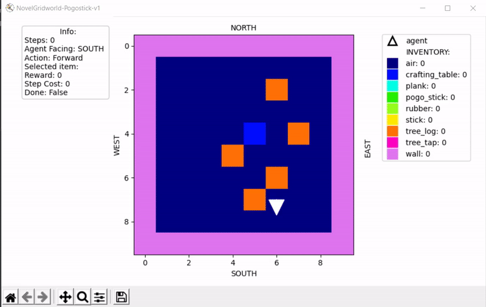
</td>
<td>
<b>additem</b>
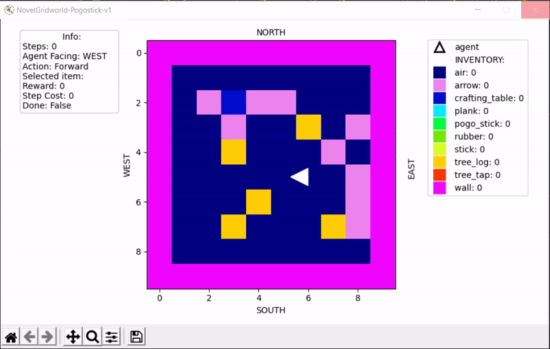
</td>
</tr>

<tr>
<td>
<b>addjump</b>
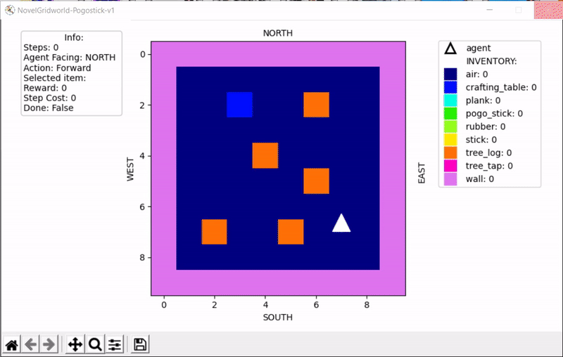
</td>
<td>
<b>axe</b>

</td>
</tr>

<tr>
<td>
<b>axetobreak</b>
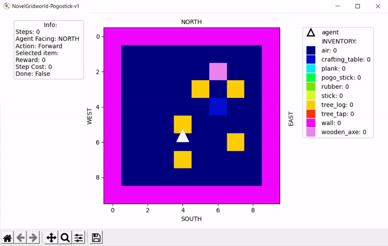
</td>
<td>
<b>breakincrease</b>
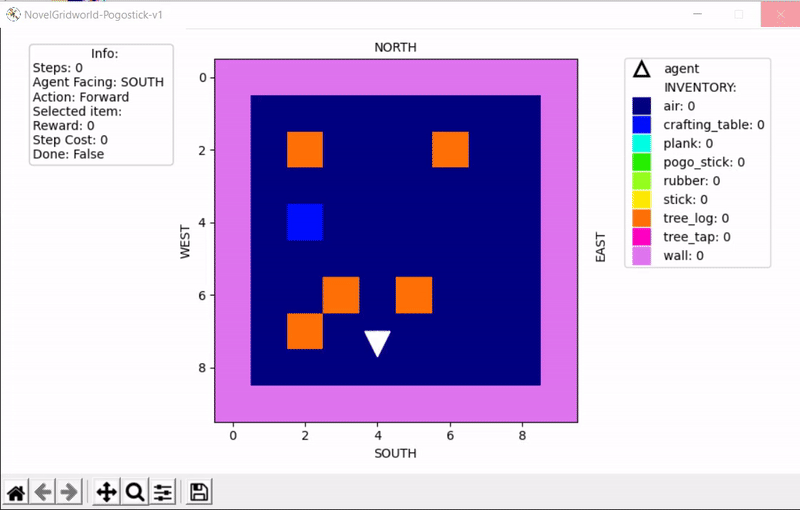
</td>
</tr>

<tr>
<td>
<b>extractincdec</b>
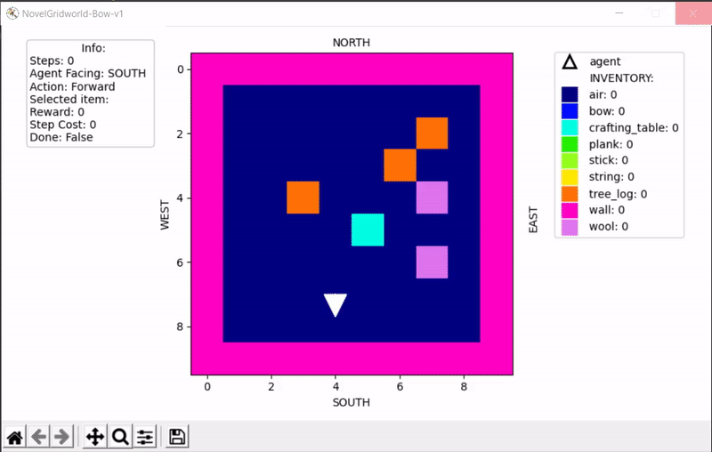
</td>
<td>
<b>fence</b>
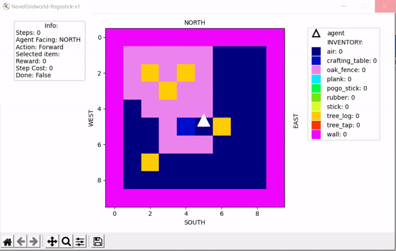
</td>
</tr>

<tr>
<td>
<b>fencerestriction</b>
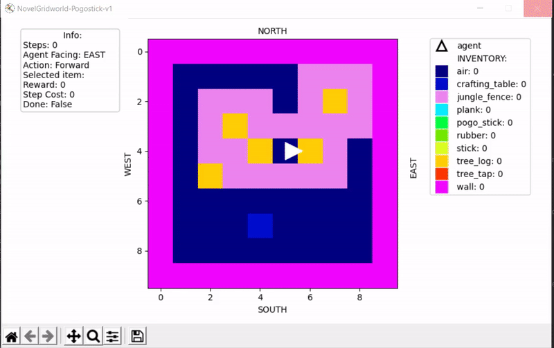
</td>
<td>
<b>firewall</b>
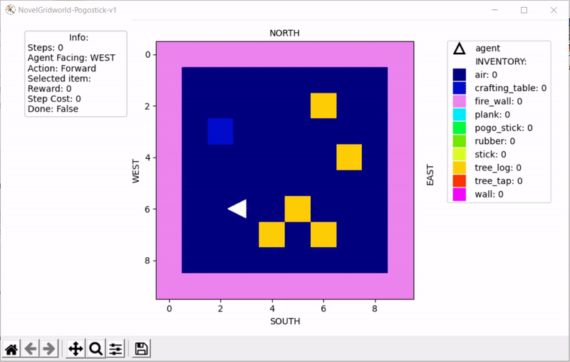
</td>
</tr>

<tr>
<td>
<b>remapaction</b>
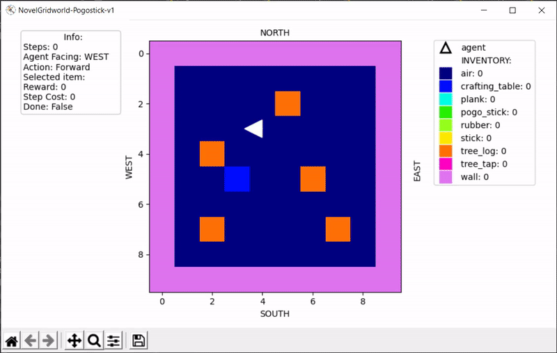
</td>
<td>
<b>replaceitem</b>
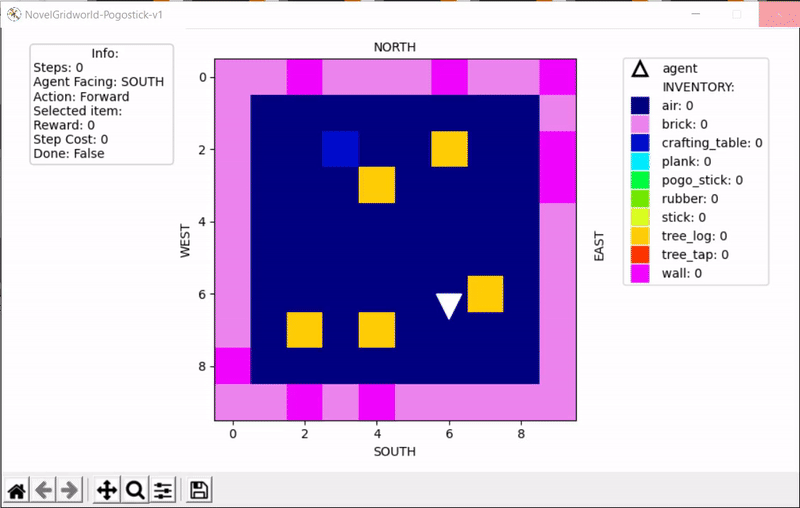
</td>
</tr>

</table>

## Wrappers

### Observation Wrappers

#### How to use Observation Wrappers?

```python
import gym
import gym_novel_gridworlds
from gym_novel_gridworlds.observation_wrappers import LidarInFront

env_id = 'NovelGridworld-Pogostick-v1'
env = gym.make(env_id)

env = LidarInFront(env, num_beams=8)
```

#### List of Observation Wrappers

<table>
<thead><tr><th>Observation Name</th><th>Observation Details</th></tr></thead>
<tbody>
 <tr><td>AgentMap</td><td>Agent's local view within a range (agent_view_size), agent_facing_id, inventory_items_quantity.</td></tr>
 <tr><td>LidarInFront</td><td>Send several beans (num_beams) at equally spaced angles in 360 degrees in front of agent + agent's current inventory.</tr>
</tbody>
</table>

### Wrappers

#### How to use Wrappers?

```python
import gym
import gym_novel_gridworlds
from gym_novel_gridworlds.wrappers import LimitActions

env_id = 'NovelGridworld-Bow-v0'
env = gym.make(env_id)

env = LimitActions(env, {'Forward', 'Left', 'Right', 'Break', 'Craft_bow'})
```

#### List of Wrappers

<table>
<thead><tr><th>Wrapper Name</th><th>Wrapper Details</th></tr></thead>
<tbody>
 <tr><td>LimitActions</td><td>Limit the actions in the environment.</tr>
 <tr><td>SaveTrajectories</td><td>Save agent trajectories in the environment.</td></tr>
</tbody>
</table>
