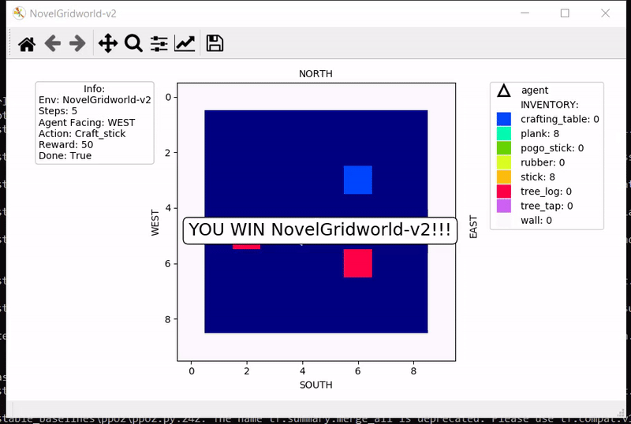
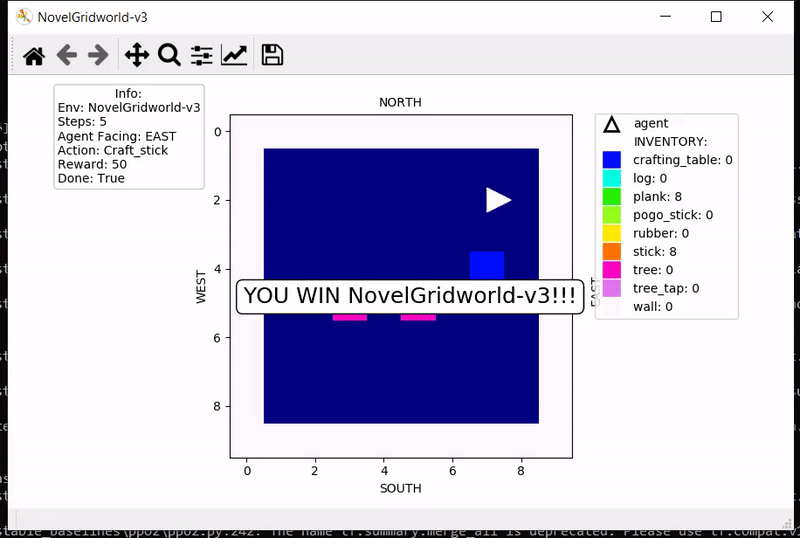
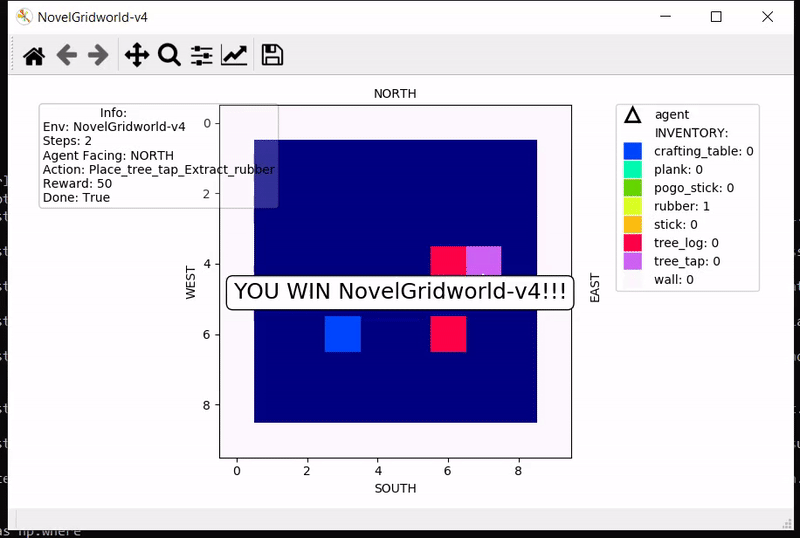
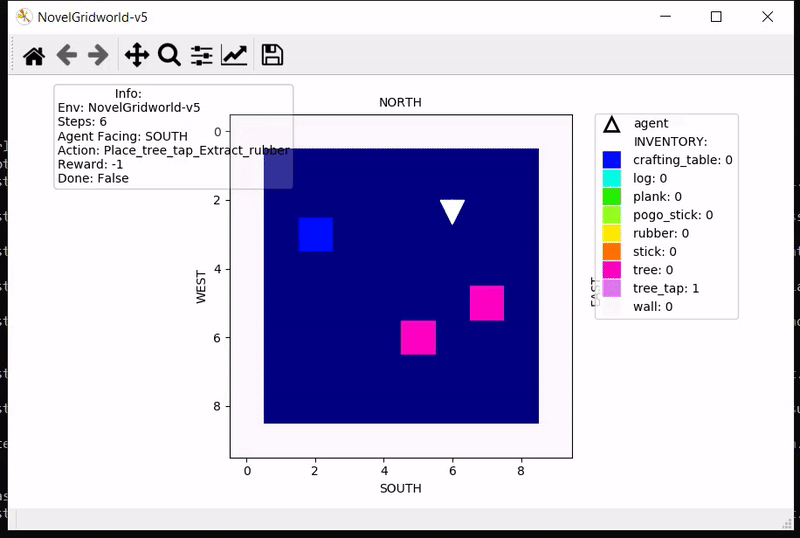

# Gym Novel Gridworlds

Gym Novel Gridworlds are environments for [OpenAI Gym](https://github.com/openai/gym).

## Installation
```
git clone https://github.com/gtatiya/gym-novel-gridworlds.git
cd gym-novel-gridworlds
pip install -e .
```

If you prefer, you can install directly from [PyPI](https://pypi.org/project/gym-novel-gridworlds/):
```
pip install gym-novel-gridworlds
```

## Development Environment

`Python 3.7.4` and following packages were used for development:<br><br>

### Python Packages
```
pip install gym==0.17.2
pip install keyboard==0.13.4
pip install matplotlib==3.1.2
pip install numpy==1.16.5
pip install stable_baselines=2.10.0
pip install tensorflow-gpu==1.14.0
```

## Running
```
import gym
import gym_novel_gridworlds

env = gym.make('NovelGridworld-v0')

done = False
while not done:
        env.render()
        action = env.action_space.sample()
        obs, reward, done, info = env.step(action)

env.close()
```

## Enjoy a Trained Agent

If the trained agent exists, then you can see it in action using:
```
python enjoy.py -env <env id> -episodes <number of episodes>
```

For example, enjoy PPO2 on NovelGridworld-v0 during 10 episodes:
```
python enjoy.py -env NovelGridworld-v0 -episodes 10
```

## Play it yourself

Play the game using keyboard interface
```
cd tests
python keyboard_interface.py
```


## [Environments](https://github.com/gtatiya/gym-novel-gridworlds/wiki#environments)

<table>

<tr>
<td>
<a href="https://github.com/gtatiya/gym-novel-gridworlds/wiki#novelgridworld-v0">NovelGridworld-v0</a>

</td>
<td>
<a href="https://github.com/gtatiya/gym-novel-gridworlds/wiki#novelgridworld-v1">NovelGridworld-v1</a>

</td>
</tr>

<tr>
<td>
<a href="https://github.com/gtatiya/gym-novel-gridworlds/wiki#novelgridworld-v2">NovelGridworld-v2</a>

</td>
<td>
<a href="https://github.com/gtatiya/gym-novel-gridworlds/wiki#novelgridworld-v3">NovelGridworld-v3</a>

</td>
</tr>

<tr>
<td>
<a href="https://github.com/gtatiya/gym-novel-gridworlds/wiki#novelgridworld-v4">NovelGridworld-v4</a>

</td>
<td>
<a href="https://github.com/gtatiya/gym-novel-gridworlds/wiki#novelgridworld-v5">NovelGridworld-v5</a>

</td>
</tr>

</table>
