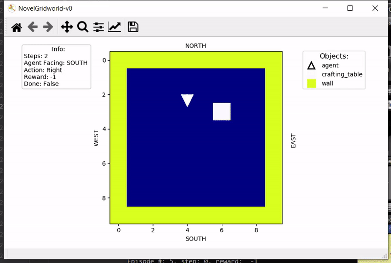
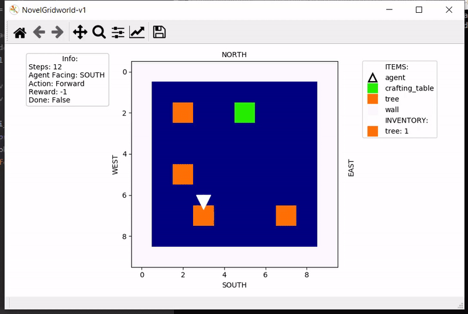

# Gym Novel Gridworlds

Gym Novel Gridworlds are environments for [OpenAI Gym](https://github.com/openai/gym).

## Installation
```
git clone https://github.com/gtatiya/gym-novel-gridworlds.git
cd gym-novel-gridworlds
pip install -e .
```
## Development Environment

`Python 3.7.4` and following packages were used for development:<br><br>

### Python Packages
```
pip install gym==0.17.2
pip install keyboard==0.13.4
pip install matplotlib==3.1.2
pip install numpy==1.16.5
pip install stable_baselines=2.10.0
pip install tensorflow-gpu==1.14.0
```

## Running
```
import gym
import gym_novel_gridworlds

env = gym.make('NovelGridworld-v0')

done = False
while not done:
        env.render()
        action = env.action_space.sample()
        obs, reward, done, info = env.step(action)

env.close()
```

## Enjoy a Trained Agent

If the trained agent exists, then you can see it in action using:
```
python enjoy.py -algo algo_name --env env_id
```

For example, enjoy PPO2 on NovelGridworld-v0 during 10 episodes:
```
python enjoy.py -env NovelGridworld-v0 -algo ppo2 -episodes 10
```

## Environments

### NovelGridworld

<table>
<tr>
<td>
NovelGridworld-v0<br/>

</td>
<td>
NovelGridworld-v1<br/>

</td>
</tr>
</table>
